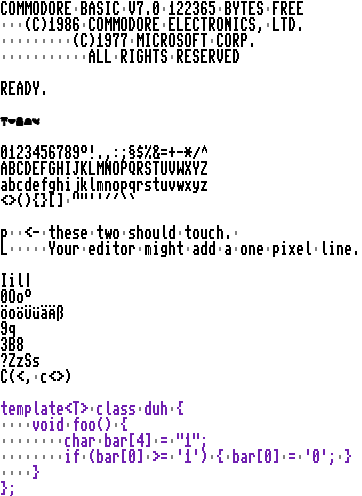

# BA67-Font
## About
The BA67 font is a merge of the original CBM
fonts from the Commodore C64/C128,
characters from [Char8.js](https://www.masswerk.at/char8/),
and lots of hand-drawn emojis. It should support
all existing Unicode characters (as of 2025-08).

It's very crisp at font sizes multiples of 6 pt
(6,12,18,24,...)

Here's an example what it might look like:


## Edit
In order to edit the font, best use the html editor
at [Github](https://github.com/KungPhoo/8x8-pixel-font-editor).

You can find the bytes.txt in this directory,
copy and paste it into the editor and edit the latest
state of BA67-Font.

## Details
The font shows crisp in font size 12 at 95 DPI.
The squared version needs size 6 or 12.

Some glyphs had been changed from the original
Commodore version:
- m: The lowercase 'M' in 8 pixels is hard. It
  was changes to look a bit better besides an
  'n'.
- l: Lowercase L to better distinguish from '1'.
  It matches 't'.
- '<' and '>' less tall to better distinguish from '(' and ')'.
- '~' was thickened to match the double-pixel style.
- Apostrophe was straightened to match the quotation
  mark to distinguish from accents. ' ´ `
- b,d,f,h,i,j,k,l,t tough the top,
  as uppercase letters do.
- right-aligned pound sign as M and W do.

## Test
Take a look at this text with BA67 loaded:
```
COMMODORE BASIC V7.0 122365 BYTES FREE
   (C)1986 COMMODORE ELECTRONICS, LTD.
         (C)1977 MICROSOFT CORP.
           ALL RIGHTS RESERVED

READY.

Emoji: 🌴 ♥ 🔒 🐴 🕊

0123456789°!.,:;§$%&=+-*/^
ABCDEFGHIJKLMNOPQRSTUVWXYZ
abcdefghijklmnopqrstuvwxyz
<>(){}[] ""''´´``

p  <- these two should touch. 
L     Your editor might add a one pixel line.

Look-alike glpyhs:
Iil|
0Oo°
OÖöo UÜüu AÄäa bßB
9q
3B8
?ZzSs

C(<  c<>)

C++ example:
template class<T> class duh {
    void foo() {
        char bar[4] = "1";
        if (bar[0] >= '1') { bar[0] = '0'; }
    }
};
```

## Build
In order to create the font, uncomment the line
`// BDFExport bdf; bdf.writeBDF(pData, "C:\\Temp\\ba67.bdf", 8, 16);`
in chardef.cpp and run a debug build on Windows.
It will create the file `C:\Temp\ba67.bdf'.

Next, open [FontForge](https://https://fontforge.org),
and install `Autotrace` as specified in their manual.
Now, create a new font, then select menu `File/Import`
and check the flag `Import as background`.

Next, select all characters `Ctrl+A` and start the
menu item `Element\Autotrace`.

Finally, export it with `File/Generate Fonts...`.

### Script
Use this script with fontforge's own python
version.
```
import fontforge

font = fontforge.font()

# Import all bitmaps into background
font.importBitmaps("./BA67.bdf", True)

# Read a preference
print(fontforge.getPrefs("PreferPotrace"))

# Change a preference
fontforge.setPrefs("PreferPotrace", True)

# Auto-trace each glyph
for g in font.glyphs():
    print(g.glyphname)
    g.autoTrace()

# Save as TTF
font.generate("./BA67.ttf")
font.generate("./BA67.woff2")
```


## PETSCII
PETSCII characters should be mapped
to the following Unicode code points:

### Unshifted
```
    00 = U+00000000 undefined
    01 = U+00000001 undefined
    02 = U+00000002 undefined
    03 = U+00000003 ETX - End of text
    04 = U+00000004 undefined
    05 = U+00000005 white color
    06 = U+00000006 undefined
    07 = U+00000007 undefined
    08 = U+00000008 disable Shift+C=
    09 = U+00000009 enable  Shift+C=
    0A = U+0000000A '\n' (ASCII)
    0B = U+0000000B undefined
    0C = U+0000000C undefined
    0D = U+0000000D '\r'
    0E = U+0000000E lowercase
    0F = U+0000000F undefined

    10 = U+00000010 undefined
    11 = U+00000011 cursor down
    12 = U+00000012 inverse colors
    13 = U+00000013 home
    14 = U+00000014 delete
    15 = U+00000015 undefined
    16 = U+00000016 undefined
    17 = U+00000017 undefined
    18 = U+00000018 undefined
    19 = U+00000019 undefined
    1A = U+0000001A undefined
    1B = U+0000001B undefined
    1C = U+0000001C red color
    1D = U+0000001D cursor right
    1E = U+0000001E green color
    1F = U+0000001F blue color

    20 = U+00000020 Space
    21 = U+00000021 !
    22 = U+00000022 "
    23 = U+00000023 #
    24 = U+00000024 $
    25 = U+00000025 %
    26 = U+00000026 &
    27 = U+00000027 '
    28 = U+00000028 (
    29 = U+00000029 )
    2A = U+0000002A *
    2B = U+0000002B +
    2C = U+0000002C ,
    2D = U+0000002D -
    2E = U+0000002E .
    2F = U+0000002F '/'

    30 = U+00000030 0
    31 = U+00000031 1
    32 = U+00000032 2
    33 = U+00000033 3
    34 = U+00000034 4
    35 = U+00000035 5
    36 = U+00000036 6
    37 = U+00000037 7
    38 = U+00000038 8
    39 = U+00000039 9
    3A = U+0000003A :
    3B = U+0000003B ;
    3C = U+0000003C <
    3D = U+0000003D =
    3E = U+0000003E >
    3F = U+0000003F ?

    40 = U+00000040 @
    41 = U+00000041 A
    42 = U+00000042 B
    43 = U+00000043 C
    44 = U+00000044 D
    45 = U+00000045 E
    46 = U+00000046 F
    47 = U+00000047 G
    48 = U+00000048 H
    49 = U+00000049 I
    4A = U+0000004A J
    4B = U+0000004B K
    4C = U+0000004C L
    4D = U+0000004D M
    4E = U+0000004E N
    4F = U+0000004F O

    50 = U+00000050 P
    51 = U+00000051 Q
    52 = U+00000052 R
    53 = U+00000053 S
    54 = U+00000054 T
    55 = U+00000055 U
    56 = U+00000056 V
    57 = U+00000057 W
    58 = U+00000058 X
    59 = U+00000059 Y
    5A = U+0000005A Z
    5B = U+0000005B [
    5C = U+000000A3 pound sign
    5D = U+0000005D ]
    5E = U+00002191 arrow up
    5F = U+00002190 arrow left

    60 = U+00002501 box drawings light horizontal
    61 = U+00002660 black spade suit
    62 = U+00002758 LIGHT VERTICAL BAR
    63 = U+00002501 BOX DRAWINGS HEAVY HORIZONTAL           1FB78 (!) box drawings light horizontal
    64 = U+0001FB77 box drawings light horizontal one quarter up
    65 = U+0001FB76 box drawings light horizontal two quarters up (bad)
    66 = U+0001FB7A box drawings light horizontal one quarter down
    67 = U+0001FB71 box drawings light vertical one quarter left
    68 = U+0001FB74 box drawings light vertical one quarter right
    69 = U+0000256E box drawings light arc down and left
    6A = U+00002570 box drawings light arc up and right
    6B = U+0000256F box drawings light arc up and left
    6C = U+0001FB7C bottom left corner
    6D = U+00002572 box drawings light diagonal upper left to lower right
    6E = U+00002571 box drawings light diagonal upper right to lower left
    6F = U+0001FB7D top left corner

    70 = U+0001FB7E top right corner
    71 = U+000025CF black circle
    72 = U+0001FB7B box drawings light horizontal two quarters down
    73 = U+00002665 black heart suit
    74 = U+0001FB70 box drawings light vertical two quarters left
    75 = U+0000256D box drawings light arc down and right
    76 = U+00002573 box drawings light diagonal cross
    77 = U+000025CB donut
    78 = U+00002663 black club suit
    79 = U+0001FB75 box drawings light vertical two quarters right
    7A = U+00002666 black diamond suit
    7B = U+0000253C box drawings light vertical and horizontal
    7C = U+0001FB8C LEFT HALF MEDIUM SHADE
    7D = U+00002503 box drawings heavy vertical
    7E = U+000003C0 greek small letter pi
    7F = U+000025E5 black upper right triangle

    80 = U+00000080 undefined
    81 = U+00000081 orange color switch
    82 = U+00000082 undefined
    83 = U+00000083 run
    84 = U+00000084 undefined
    85 = U+00000085 F1
    86 = U+00000086 F3
    87 = U+00000087 F5
    88 = U+00000088 F7
    89 = U+00000089 F2
    8A = U+0000008A F4
    8B = U+0000008B F6
    8C = U+0000008C F8
    8D = U+0000008D Shift+Return
    8E = U+0000008E Uppercase
    8F = U+0000008F undefined

    90 = U+00000090 black color
    91 = U+00000091 cursor up
    92 = U+00000092 turn off inverse colors
    93 = U+00000093 clear
    94 = U+00000094 insert
    95 = U+00000095 brown color
    96 = U+00000096 pink/light red color
    97 = U+00000097 dark gray color
    98 = U+00000098 medium gray color
    99 = U+00000099 light green color
    9A = U+0000009A light blue color
    9B = U+0000009B light gray color
    9C = U+0000009C purple color
    9D = U+0000009D cursor left
    9E = U+0000009E yellow color
    9F = U+0000009F cyan color

    A0 = U+000000A0 no breaking space
    A1 = U+0000258C left half block
    A2 = U+00002584 lower half block
    A3 = U+00002594 upper one eighth block
    A4 = U+00002581 lower one eighth block
    A5 = U+0000258E left one quarter block  258F (!) left one eighth block
    A6 = U+0001FB90 INVERSE MEDIUM SHADE
    A7 = U+0001FB87 RIGHT ONE QUARTER BLOCK
    A8 = U+0001FB8F LOWER HALF MEDIUM SHADE
    A9 = U+000025E4 black upper left triangle
    AA = U+0001FB87 RIGHT ONE QUARTER BLOCK
    AB = U+00002523 box drawings heavy vertical and right
    AC = U+00002597 black small square lower right
    AD = U+00002517 box drawings heavy up and right
    AE = U+00002513 box drawings heavy down and left
    AF = U+00002582 lower one quarter block

    B0 = U+0000250F box drawings heavy down and right
    B1 = U+0000253B box drawings heavy up and horizontal
    B2 = U+00002533 box drawings heavy down and horizontal
    B3 = U+0000252B box drawings heavy vertical and left
    B4 = U+0000258E left one quarter block
    B5 = U+0000258D left three eights block
    B6 = U+0001FB88 RIGHT THREE EIGHTHS BLOCK
    B7 = U+0001FB82 UPPER ONE QUARTER BLOCK
    B8 = U+0001FB83 UPPER THREE EIGHTHS BLOCK
    B9 = U+00002583 lower three eights block
    BA = U+0001FB7F bottom right corner
    BB = U+00002596 black small square lower left
    BC = U+0000259D black small square upper rights
    BD = U+0000251B box drawings heavy up and left
    BE = U+00002598 black small square upper left
    BF = U+0000259A two small black squares diagonal left to right

    C0 = U+00002501 box drawings light horizontal
    C1 = U+00002660 black spade suit
    C2 = U+00002758 LIGHT VERTICAL BAR
    C3 = U+00002501 BOX DRAWINGS HEAVY HORIZONTAL           1FB78 (!) box drawings light horizontal
    C4 = U+0001FB77 box drawings light horizontal one quarter up
    C5 = U+0001FB76 box drawings light horizontal two quarters up (bad)
    C6 = U+0001FB7A box drawings light horizontal one quarter down
    C7 = U+0001FB71 box drawings light vertical one quarter left
    C8 = U+0001FB74 box drawings light vertical one quarter right
    C9 = U+0000256E box drawings light arc down and left
    CA = U+00002570 box drawings light arc up and right
    CB = U+0000256F box drawings light arc up and left
    CC = U+0001FB7C bottom left corner
    CD = U+00002572 box drawings light diagonal upper left to lower right
    CE = U+00002571 box drawings light diagonal upper right to lower left
    CF = U+0001FB7D top left corner

    D0 = U+0001FB7E top right corner
    D1 = U+000025CF black circle
    D2 = U+0001FB7B box drawings light horizontal two quarters down
    D3 = U+00002665 black heart suit
    D4 = U+0001FB70 box drawings light vertical two quarters left
    D5 = U+0000256D box drawings light arc down and right
    D6 = U+00002573 box drawings light diagonal cross
    D7 = U+000025CB donut
    D8 = U+00002663 black club suit
    D9 = U+0001FB75 box drawings light vertical two quarters right
    DA = U+00002666 black diamond suit
    DB = U+0000253C box drawings light vertical and horizontal
    DC = U+0001FB8C LEFT HALF MEDIUM SHADE
    DD = U+00002503 box drawings heavy vertical
    DE = U+000003C0 greek small letter pi
    DF = U+000025E5 black upper right triangle

    E0 = U+000000A0 no-break space
    E1 = U+0000258C left half block
    E2 = U+00002584 lower half block
    E3 = U+00002594 upper one eighth block
    E4 = U+00002581 lower one eighth block
    E5 = U+0000258E left one quarter block   /* 0xE5 = U+0000258F (!) left one eighth block
    E6 = U+0001FB90 INVERSE MEDIUM SHADE
    E5 = U+0001FB87 RIGHT ONE QUARTER BLOCK           /* 0xE7 = U+00002595 (!) right one eighth block
    E8 = U+0001FB8F LOWER HALF MEDIUM SHADE
    E9 = U+000025E4 black upper left triangle
    EA = U+0001FB87 right one quarter block
    EB = U+00002523 box drawings heavy vertical and right
    EC = U+00002597 black small square lower right
    ED = U+00002517 box drawings heavy up and right
    EE = U+00002513 box drawings heavy down and left
    EF = U+00002582 lower one quarter block

    F0 = U+0000250F box drawings heavy down and right
    F1 = U+0000253B box drawings heavy up and horizontal
    F2 = U+00002533 box drawings heavy down and horizontal
    F3 = U+0000252B box drawings heavy vertical and left
    F4 = U+0000258E left one quarter block
    F5 = U+0000258D left three eights block
    F6 = U+0001FB88 right three eights block
    F7 = U+0001FB82 upper one quarter block
    F8 = U+0001FB83 upper three eights block
    F9 = U+00002583 lower three eights block
    FA = U+0001FB7F bottom right corner
    FB = U+00002596 black small square lower left
    FC = U+0000259D black small square upper right
    FD = U+0000251b box drawings heavy up and left
    FE = U+00002598 black small square upper left
    FF = U+000003C0 greek small letter pi
```
### Shifted
```
    00 = U+00000000 UNDEFINED
    01 = U+00000001 UNDEFINED
    02 = U+00000002 UNDEFINED
    03 = U+00000003 ETX - END OF TEXT
    04 = U+00000004 UNDEFINED
    05 = U+00000005 WHITE COLOR
    06 = U+00000006 UNDEFINED
    07 = U+00000007 UNDEFINED
    08 = U+00000008 DISABLE SHIFT+C=
    09 = U+00000009 ENABLE  SHIFT+C=
    0A = U+0000000A '\n' (ASCII)
    0B = U+0000000B UNDEFINED
    0C = U+0000000C UNDEFINED
    0D = U+0000000D '\r'
    0E = U+0000000E LOWERCASE
    0F = U+0000000F UNDEFINED

    10 = U+00000010 UNDEFINED
    11 = U+00000011 CURSOR DOWN
    12 = U+00000012 INVERSE COLORS
    13 = U+00000013 HOME
    14 = U+00000014 DELETE
    15 = U+00000015 UNDEFINED
    16 = U+00000016 UNDEFINED
    17 = U+00000017 UNDEFINED
    18 = U+00000018 UNDEFINED
    19 = U+00000019 UNDEFINED
    1A = U+0000001A UNDEFINED
    1B = U+0000001B UNDEFINED
    1C = U+0000001C RED COLOR
    1D = U+0000001D CURSOR RIGHT
    1E = U+0000001E GREEN COLOR
    1F = U+0000001F BLUE COLOR

    20 = U+00000020 SPACE
    21 = U+00000021 !
    22 = U+00000022 "
    23 = U+00000023 #
    24 = U+00000024 $
    25 = U+00000025 %
    26 = U+00000026 &
    27 = U+00000027 '
    28 = U+00000028 (
    29 = U+00000029 )
    2A = U+0000002A *
    2B = U+0000002B +
    2C = U+0000002C ,
    2D = U+0000002D -
    2E = U+0000002E .
    2F = U+0000002F '/'

    30 = U+00000030 0
    31 = U+00000031 1
    32 = U+00000032 2
    33 = U+00000033 3
    34 = U+00000034 4
    35 = U+00000035 5
    36 = U+00000036 6
    37 = U+00000037 7
    38 = U+00000038 8
    39 = U+00000039 9
    3A = U+0000003A :
    3B = U+0000003B ;
    3C = U+0000003C <
    3D = U+0000003D =
    3E = U+0000003E >
    3F = U+0000003F ?

    40 = U+00000040 @
    41 = U+00000061 a
    42 = U+00000062 b
    43 = U+00000063 c
    44 = U+00000064 d
    45 = U+00000065 e
    46 = U+00000066 f
    47 = U+00000067 g
    48 = U+00000068 h
    49 = U+00000069 i
    4A = U+0000006A j
    4B = U+0000006B k
    4C = U+0000006C l
    4D = U+0000006D m
    4E = U+0000006E n
    4F = U+0000006F o

    50 = U+00000070 p
    51 = U+00000071 q
    52 = U+00000072 r
    53 = U+00000073 s
    54 = U+00000074 t
    55 = U+00000075 u
    56 = U+00000076 v
    57 = U+00000077 w
    58 = U+00000078 x
    59 = U+00000079 y
    5A = U+0000007A z
    5B = U+0000005B [
    5C = U+000000A3 POUND SIGN !THERE'S NO BACKSLASH '\' IN PETSCII!
    5D = U+0000005D ]
    5E = U+00002191 ARROW UP
    5F = U+00002190 ARROW LEFT

    60 = U+00002501 BOX DRAWINGS LIGHT HORIZONTAL
    61 = U+00000041 A
    62 = U+00000042 B
    63 = U+00000043 C
    64 = U+00000044 D
    65 = U+00000045 E
    66 = U+00000046 F
    67 = U+00000047 G
    68 = U+00000048 H
    69 = U+00000049 I
    6A = U+0000004A J
    6B = U+0000004B K
    6C = U+0000004C L
    6D = U+0000004D M
    6E = U+0000004E N
    6F = U+0000004F O

    70 = U+00000050 P
    71 = U+00000051 Q
    72 = U+00000052 R
    73 = U+00000053 S
    74 = U+00000054 T
    75 = U+00000055 U
    76 = U+00000056 V
    77 = U+00000057 W
    78 = U+00000058 X
    79 = U+00000059 Y
    7A = U+0000005A Z
    7B = U+0000253C BOX DRAWINGS LIGHT VERTICAL AND HORIZONTAL
    7C = U+0001FB8C LEFT HALF MEDIUM SHADE
    7D = U+00002503 BOX DRAWINGS HEAVY VERTICAL
    7E = U+00002592 MEDIUM SHADE
    7F = U+0001FB98 UPPER LEFT TO LOWER RIGHT FILL '\\'

    80 = U+00000080 UNDEFINED
    81 = U+00000081 ORANGE COLOR SWITCH
    82 = U+00000082 UNDEFINED
    83 = U+00000083 RUN
    84 = U+00000084 UNDEFINED
    85 = U+00000085 F1
    86 = U+00000086 F3
    87 = U+00000087 F5
    88 = U+00000088 F7
    89 = U+00000089 F2
    8A = U+0000008A F4
    8B = U+0000008B F6
    8C = U+0000008C F8
    8D = U+0000008D SHIFT+RETURN
    8E = U+0000008E UPPERCASE
    8F = U+0000008F UNDEFINED

    90 = U+00000090 BLACK COLOR
    91 = U+00000091 CURSOR UP
    92 = U+00000092 TURN OFF INVERSE COLORS
    93 = U+00000093 CLEAR
    94 = U+00000094 INSERT
    95 = U+00000095 BROWN COLOR
    96 = U+00000096 PINK/LIGHT RED COLOR
    97 = U+00000097 DARK GRAY COLOR
    98 = U+00000098 MEDIUM GRAY COLOR
    99 = U+00000099 LIGHT GREEN COLOR
    9A = U+0000009A LIGHT BLUE COLOR
    9B = U+0000009B LIGHT GRAY COLOR
    9C = U+0000009C PURPLE COLOR
    9D = U+0000009D CURSOR LEFT
    9E = U+0000009E YELLOW COLOR
    9F = U+0000009F CYAN COLOR

    A0 = U+000000A0 NO BREAKING SPACE
    A1 = U+0000258C LEFT HALF BLOCK
    A2 = U+00002584 LOWER HALF BLOCK
    A3 = U+000000A3 POUND SIGN (COMPATIBLE WITH ASCII!)
    A4 = U+00002581 LOWER ONE EIGHTH BLOCK
    A5 = U+0000258E LEFT ONE QUARTER BLOCK  258F (!) LEFT ONE EIGHTH BLOCK
    A6 = U+0001FB90 INVERSE MEDIUM SHADE
    A7 = U+0001FB87 RIGHT ONE QUARTER BLOCK
    A8 = U+0001FB8F LOWER HALF MEDIUM SHADE
    A9 = U+000025E4 BLACK UPPER LEFT TRIANGLE
    AA = U+0001FB87 RIGHT ONE QUARTER BLOCK
    AB = U+00002523 BOX DRAWINGS HEAVY VERTICAL AND RIGHT
    AC = U+00002597 BLACK SMALL SQUARE LOWER RIGHT
    AD = U+00002517 BOX DRAWINGS HEAVY UP AND RIGHT
    AE = U+00002513 BOX DRAWINGS HEAVY DOWN AND LEFT
    AF = U+00002582 LOWER ONE QUARTER BLOCK

    B0 = U+0000250F BOX DRAWINGS HEAVY DOWN AND RIGHT
    B1 = U+0000253B BOX DRAWINGS HEAVY UP AND HORIZONTAL
    B2 = U+00002533 BOX DRAWINGS HEAVY DOWN AND HORIZONTAL
    B3 = U+0000252B BOX DRAWINGS HEAVY VERTICAL AND LEFT
    B4 = U+0000258E LEFT ONE QUARTER BLOCK
    B5 = U+0000258D LEFT THREE EIGHTS BLOCK
    B6 = U+0001FB88 RIGHT THREE EIGHTHS BLOCK
    B7 = U+0001FB82 UPPER ONE QUARTER BLOCK
    B8 = U+0001FB83 UPPER THREE EIGHTHS BLOCK
    B9 = U+00002583 LOWER THREE EIGHTS BLOCK
    BA = U+0001FB7F BOTTOM RIGHT CORNER
    BB = U+00002596 BLACK SMALL SQUARE LOWER LEFT
    BC = U+0000259D BLACK SMALL SQUARE UPPER RIGHTS
    BD = U+0000251B BOX DRAWINGS HEAVY UP AND LEFT
    BE = U+00002598 BLACK SMALL SQUARE UPPER LEFT
    BF = U+0000259A TWO SMALL BLACK SQUARES DIAGONAL LEFT TO RIGHT

    C0 = U+00002501 BOX DRAWINGS LIGHT HORIZONTAL
    C1 = U+00000041 A
    C2 = U+00000042 B
    C3 = U+00000043 C
    C4 = U+00000044 D
    C5 = U+00000045 E
    C6 = U+00000046 F
    C7 = U+00000047 G
    C8 = U+00000048 H
    C9 = U+00000049 I
    CA = U+0000004A J
    CB = U+0000004B K
    CC = U+0000004C L
    CD = U+0000004D M
    CE = U+0000004E N
    CF = U+0000004F O

    D0 = U+00000050 P
    D1 = U+00000051 Q
    D2 = U+00000052 R
    D3 = U+00000053 S
    D4 = U+00000054 T
    D5 = U+00000055 U
    D6 = U+00000056 V
    D7 = U+00000057 W
    D8 = U+00000058 X
    D9 = U+00000059 Y
    DA = U+0000005A Z
    DB = U+0000253C BOX DRAWINGS LIGHT VERTICAL AND HORIZONTAL
    DC = U+0001FB8C LEFT HALF MEDIUM SHADE
    DD = U+00002503 BOX DRAWINGS HEAVY VERTICAL
    DE = U+00002592 MEDIUM SHADE
    DF = U+0001FB98 UPPER LEFT TO LOWER RIGHT FILL '\\'

    E0 = U+000000A0 NO-BREAK SPACE
    E1 = U+0000258C LEFT HALF BLOCK
    E2 = U+00002584 LOWER HALF BLOCK
    E3 = U+00002594 UPPER ONE EIGHTH BLOCK
    E4 = U+00002581 LOWER ONE EIGHTH BLOCK
    E5 = U+0000258E LEFT ONE QUARTER BLOCK
    E6 = U+0001FB90 INVERSE MEDIUM SHADE
    E5 = U+0001FB87 RIGHT ONE QUARTER BLOCK
    E8 = U+0001FB8F LOWER HALF MEDIUM SHADE
    E9 = U+0001fb99 UPPER RIGHT TO LOWER LEFT FILL '//'
    EA = U+0001FB87 RIGHT ONE QUARTER BLOCK
    EB = U+00002523 BOX DRAWINGS HEAVY VERTICAL AND RIGHT
    EC = U+00002597 BLACK SMALL SQUARE LOWER RIGHT
    ED = U+00002517 BOX DRAWINGS HEAVY UP AND RIGHT
    EE = U+00002513 BOX DRAWINGS HEAVY DOWN AND LEFT
    EF = U+00002582 LOWER ONE QUARTER BLOCK

    F0 = U+0000250F BOX DRAWINGS HEAVY DOWN AND RIGHT
    F1 = U+0000253B BOX DRAWINGS HEAVY UP AND HORIZONTAL
    F2 = U+00002533 BOX DRAWINGS HEAVY DOWN AND HORIZONTAL
    F3 = U+0000252B BOX DRAWINGS HEAVY VERTICAL AND LEFT
    F4 = U+0000258E LEFT ONE QUARTER BLOCK
    F5 = U+0000258D LEFT THREE EIGHTS BLOCK
    F6 = U+0001FB88 RIGHT THREE EIGHTS BLOCK
    F7 = U+0001FB82 UPPER ONE QUARTER BLOCK
    F8 = U+0001FB83 UPPER THREE EIGHTS BLOCK
    F9 = U+00002583 LOWER THREE EIGHTS BLOCK
    FA = U+00002713 CHECK MARK
    FB = U+00002596 BLACK SMALL SQUARE LOWER LEFT
    FC = U+0000259D BLACK SMALL SQUARE UPPER RIGHT
    FD = U+0000251b BOX DRAWINGS HEAVY UP AND LEFT
    FE = U+00002598 BLACK SMALL SQUARE UPPER LEFT
    FF = U+00002592 MEDIUM SHADE
```


## License
See LICENSE file.
Very liberate.

